# INTRODUCTION

## Table of Contents

:::tip Visit Code Repository
[**Github: Intro to Verilog**](https://github.com/hwlabnitc/Intro-to-Verilog)
:::

|Topic|
|---|
|[Introduction](#introduction)|
|[Verilog Syntax](#verilog-syntax)|
|[Basic Logic Gates](#basic-logic-gates)|
|[Binary Adders and Subtractors](#binary-adders-and-subtractors)|
|[Latches](#latches)|
|[Flip Flops](#flip-flops)|
|[Multiplexers](#multiplexers)|
|[Demultiplexers](#demultiplexers)|
|[Parity Generator](#parity-generator)|
|[Code converter](#code-converter)|
|[Comparators](#comparators)|
|[Registers](#registers)|
|[Counters](#counters)|
|[Arithmetic Logic Unit](#arithmetic-logic-unit-alu)|
|[Encoders](#encoder)|
|[Decoders](#decoder)|
|[How to make a verilog program](#how-to-make-a-verilog-program)|
|[Bibliography](#bibliography)|
---

Verilog is a **Hardware Description Language (HDL)**. They resemble
programming languages specifically oriented to describe hardware
structures and their behavior. This language describes an interconnection of
components. Such a structural description, a netlist, can be used as input to
logic simulation just as a schematic is used.  

A typical procedure is used in employing an HDL description as simulation
input. The steps in the procedure are analysis, elaboration, and
initialization, followed by the simulation.  
Analysis checks the description for violations of the syntax and semantic
rules for the HDL and produces an intermediate representation of the
design.  

Elaboration traverses the design hierarchy represented by the description; in
this process, the design hierarchy is flattened to an interconnection of
modules described only by their behaviors.  
The result of the analysis and elaboration performed by the compiler is a
simulation model of the original HDL description. This model is then passed
to the simulator for execution. Initialization sets all of the variables in the
simulation model to specified or default values.  
Simulation executes the simulation model in either batch or interactive
mode with inputs specified by the user.  

The testbench is a description that includes the design to be tested,
typically referred to as the Device Under Test (DUT). The testbench describes
a collection of hardware and software functions that apply inputs to the DUT
and analyze the outputs for correctness.  
Verilog supports a design at many levels of abstraction. The primary three
kinds of abstraction in Verilog are
- Behavioral level  
- Register-transfer level  
- Gate level  
  
### Behavioral: 

This is the highest level of abstraction provided by Verilog HDL. It
describes the circuit using procedural statements (the "always" block, case,
and if statements). At the behavioral level, the circuit is described using an
algorithm consisting of a set of instructions executed one after the other
sequentially.  

### Data-Flow:

This is the second highest level of abstraction. It specifies the
circuit as a combination of operations and data transfer between the
registers. In this approach, the 'assign' statement is used. An assign
statement is a continuous statement where any signal changes on the
right-hand side will update the output signal. Changes in the inputs are
continuously monitored. Any synthesizable code is called RTL code.
Gate-Level: This is the lowest level of abstraction. Here, the circuit is
described by logical links and their timing properties. The module is
implemented in terms of logic gates and interconnections between these
gates. It resembles a schematic drawing with components connected with
signals.

## Functional Differences

### Behavioral Level

#### Pros

- Easy to write and understand, especially for complex algorithms and
high-level functionality.
- Portability: the same behavioral code can be synthesized into different
hardware architectures.
- Enables early verification, allowing designers to test system
functionality before committing to a particular hardware architecture. 

#### Cons

- Less control over the hardware implementation details. 
- Can be less efficient in terms of area, power, and performance than
lower levels of abstraction.
- More difficult to optimize for timing and power.

### Register Transfer Level (RTL)

#### Pros

- Offers greater control over the hardware implementation details.
- Can be optimized for timing, power, and area, allowing for more
efficient designs.
- Can be used for both simulation and synthesis.
Cons
- More difficult to write and understand than the behavioral level.
- Can be less portable than the behavioral level, since the same code
may not synthesize correctly across different architectures.
- Can be more difficult to verify than the behavioral level, since the
design is more complex.  

### Gate Level

#### Pros

- Provides the most detailed view of the hardware implementation.
- Highly optimized for area, power, and performance.
- Ideal for final verification of the design.
Cons
- Very difficult to write and understand.
- Not portable: The code is specific to a particular hardware architecture.
- Verification can be very time-consuming and difficult, especially for
complex designs.

---

## VERILOG SYNTAX

#### CODE:

```v
module half_adder(output s, c, input a, b);
    assign s = a ^ b;
    assign c = a & b;
endmodule
```

```module``` is always terminated by ```endmodule```. Always specify output first and
then input.

#### TESTBENCH:

```v
module half_adder_test;
    reg in1, in2;
    wire out1, out2;
    half_adder a1(out1,out2 ,in1, in2);
    reg [2:0]count;
    initial begin
        for(count=0; count<4; count = count+1)
        begin
        {in1, in2} = count[1:0];
        #20;
        end
    end
endmodule
```

```reg```: store input values  
```wire```: store output values
begin end is used to specify a block of code.

--- 

# BASIC LOGIC GATES

Logic gates are basic building blocks of digital electronics circuits that
perform logical operations on one or more binary inputs and produce a
binary output. In other words, a logic gate is an electronic device that
operates on logical signals (digital signals) to perform a Boolean function.

There are several types of logic gates, including:

```AND``` **gate:** It has two or more input signals and produces a HIGH output only
if all inputs are HIGH. The AND gate symbol is the dot or multiplication
symbol.

```OR``` **gate:**  It has two or more input signals and produces a HIGH output if at
least one input is HIGH. The OR gate symbol is the plus symbol.

```NOT``` gate (Inverter): It has one input signal and produces the complement
of the input signal at its output. The NOT gate symbol is a triangle with a
circle at the output.

```NAND``` **gate:** It is a combination of an AND gate and a NOT gate. It produces
a LOW output only if all inputs are HIGH. The NAND gate symbol is an AND
gate with a small circle at its output.

```NOR``` **gate:** It is a combination of an OR gate and a NOT gate. It produces a
HIGH output only if all inputs are LOW. The NOR gate symbol is an OR gate
with a small circle at its output.

```XOR``` **gate:** It has two input signals and produces a HIGH output if the two
inputs are different (i.e., one input is HIGH and the other is LOW). The XOR
gate symbol is the addition symbol with a circle around it.

```XNOR``` **gate:** It is a combination of an XOR gate and a NOT gate. It produces a
HIGH output if the two inputs are the same (i.e., both inputs are HIGH or
both inputs are LOW). The XNOR gate symbol is an XOR gate with a small
circle at its output.

## Binary Adders and Subtractors  

### HALF ADDER

A half-adder is an arithmetic circuit that generates the
sum of two binary digits. The circuit has two inputs and
two outputs. The input variables are the augend and
addend bits to be added, and the output variables
produce the sum and carry.

The Boolean functions for the two outputs, easily
obtained from the truth table, are  

S = XY + XY = X ⊕ Y

C = XY


|x|y|C|S|
|---|---|----|----|
|0|0|0|0|
|0|1|0|1|
|1|0|0|1|
|1|1|1|0|

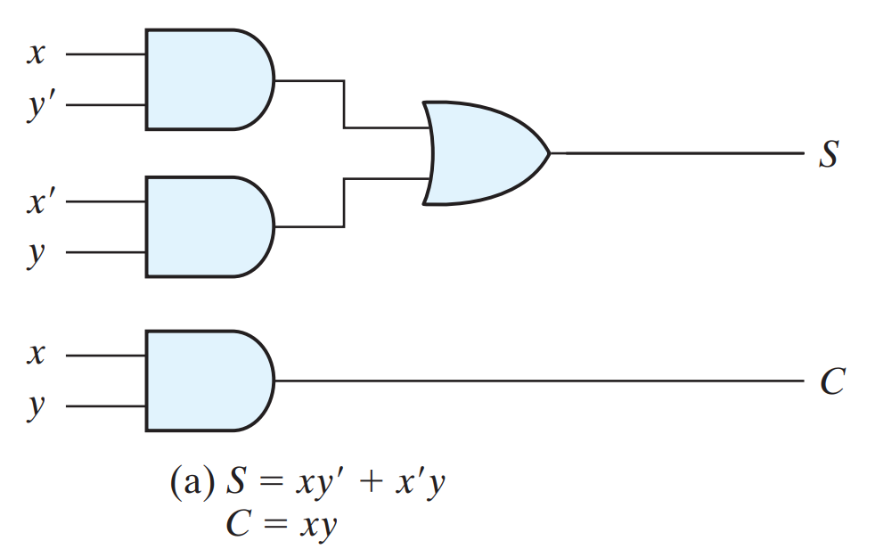

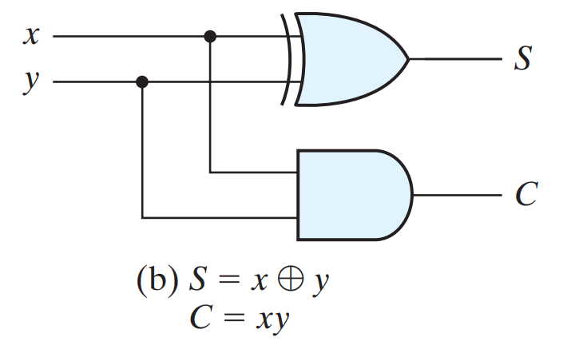

### FULL ADDER
A full adder is a combinational circuit that forms
the arithmetic sum of three input bits. Two input
variables, denoted by X and Y, represent the two
significant bits to be added. The third input, Z,
represents the carry from the previous lower
significant position.  
The simplified sum-of-product functions for the
two outputs are :

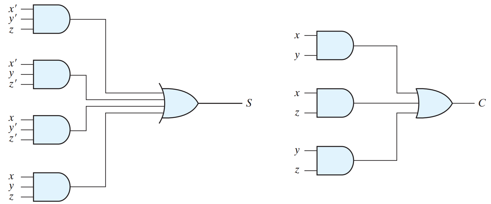

**S = XYZ + XYZ + XY Z + XYZ**   
**C = XY + XZ + YZ**


S = (X ⊕ Y) ⊕ Z

C = XY + Z(X ⊕ Y)


### RIPPLE CARRY ADDER  

A parallel binary adder is a digital circuit that produces the arithmetic sum of
two binary numbers using only combinational logic. The parallel adder uses
n full adders in parallel, with all input bits applied simultaneously to produce
the sum.  
The full adders are connected in cascade, with the carry output from one full
adder connected to the carry input of the next full adder. Since a 1 carry may
appear near the least significant bit of the adder and yet propagate through
many full adders to the most significant bit, just as a wave ripples outward
from a pebble dropped in a pond, the parallel adder is referred to as a ripple
carry adder.

### CARRY LOOK AHEAD ADDER

Define two new binary variables  
|Pi = Ai XOR Bi|  
|---|

|Gi = Ai AND Bi|
|---|
 
the output sum and carry can respectively be expressed as  

**Si = Pi XOR Ci**  
**Ci+1 = Gi + (Pi AND Ci)**

Each sum output requires two exclusive-OR gates. The output of the first
exclusive-OR gate generates the Pi variable, and the AND gate generates the
Gi variable. The carries are propagated through the carry lookahead
generator and applied as inputs to the second exclusive-OR gate. All output
carries are generated after a delay through two levels of gates. Thus, outputs
S1 through S3 have equal propagation delay times.

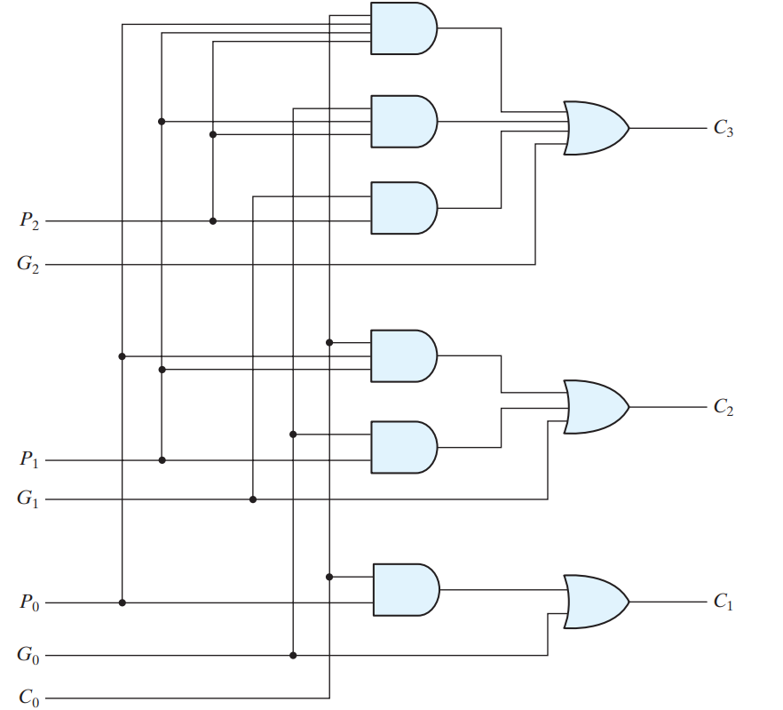


### HALF SUBTRACTOR
A half subtractor is a combinational circuit that subtracts two single-bit
binary numbers (A and B) and produces two output bits: the difference (D)
and the borrow (B). The half subtractor is called "half" because it can only
subtract two single-bit binary numbers, unlike a full subtractor that can
subtract two multi-bit binary numbers.
D= A XOR B
B’ = Abar AND B

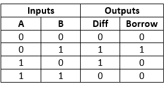 

### FULL SUBTRACTOR
A full subtractor is a combinational circuit that subtracts two single-bit
binary numbers (A and B) along with a borrow (Bin) and produces two
output bits: the difference (D) and the borrow (Bout). The full subtractor is an
extension of the half subtractor, which can only subtract two single-bit
binary numbers.  

D = A XOR B XOR Bin  
B’ = Abar AND B OR ((A XOR B)bar)Bin

 
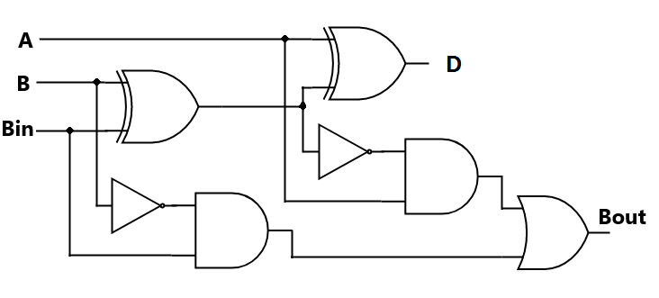

### BINARY ADDER AND SUBTRACTOR
M-N where M-minuend and N is subtrahend
When performing a subtraction we complement the subtrahend N, and
when performing an addition we do not complement N.

The 2s complement can be obtained by taking the 1s complement and
adding 1 to the least significant bit. The 1s complement can be implemented
easily with inverter circuits, and we can add 1 to the sum by making the
input carry of the parallel adder equal to 1.
The input carry C0 must be equal to 1. The operation that is performed
becomes A plus the 1s complement of B plus 1. This is equal to A plus the 2s
complement of B. For unsigned numbers, it gives A - B if A >= B or the 2s
complement of B - A if A []( B


## LATCHES
### SR LATCH
The SR latch is a circuit constructed from two cross- coupled NOR gates. The latch has two inputs, labeled S for set and R for reset, and two useful states.
When output Q = 1 and Q = 0, the latch is said to be in the set state. When Q = 0 and Q = 1, it is in the reset state. Outputs Q and Q are normally the
complements of each other. When both inputs are equal to 1 at the same time, an undefined state with both outputs equal to 0 occurs.


### S̅R̅ LATCH
The SR latch with two cross- coupled NAND gates. It operates with both
inputs normally at 1, unless the state of the latch has to be changed.
The application of a 0 to the S input causes output Q to go to 1, putting the
latch in the set state. When the S input goes back to 1, the circuit remains in
the set state. With both inputs at 1, the state of the latch is changed by
placing a 0 on the R input. This causes the circuit to go to the reset state and
stay there, even after both inputs return to 1. The condition that is undefined
for this NAND latch is when both inputs are equal to 0 at the same time, an
input combination that should be avoided. When the NAND latch requires a
0 signal to change its state, it is referred to as an SR latch.

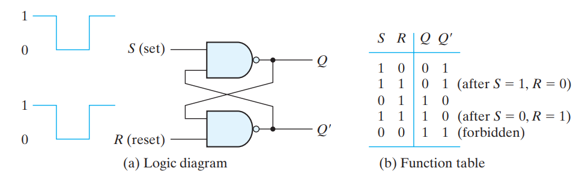

### SR LATCH WITH CONTROL INPUT

It consists of the basic NAND latch and two additional NAND gates. The control input C acts as an enable signal for the other two inputs. The output of the NAND gates stays at the logic- 1 level as long as the control input remains at 0.  
When the control input goes to 1, information from the S and R inputs is
allowed to affect the S R latch. The set state is reached with S = 1, R = 0, and C
= 1. To change to the reset state, the inputs must be S = 0, R = 1, and C = 1. In either case, when C returns to 0, the circuit remains in its current state.
Control input C = 0 disables the circuit so that the state of the output does not change, regardless of the values of S and R.
Moreover, when C = 1 and both the S and R inputs are equal to 0, the state of the circuit does not change.An undefined state occurs when all three inputs are equal to 1. This condition places 0s on both inputs of the basic S R latch,
giving an undefined state.

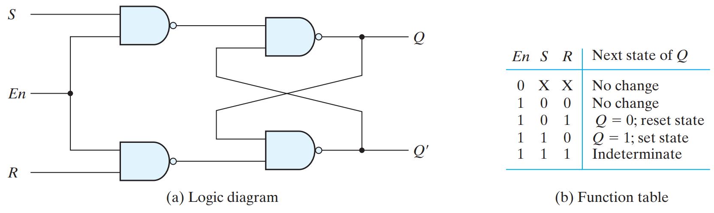

### D LATCH

One way to eliminate the undesirable undefined state in the SR latch is to ensure that inputs S and R are never equal to 1 at the same time. This is done in the D latch, shown in Figure 4-8. This latch has only two inputs: D (data)
and C (control). The complement of the D input goes directly to the S input, and D is applied to the R input.  
As long as the control input is 0, the S R latch has both inputs at the 1 level, and the circuit cannot change state regardless of the value of D. The D input is sampled when C = 1. If D is 1, the Q output goes to 1, placing the circuit in the set state. If D is 0, output Q goes to 0, placing the circuit in the reset state. The D latch receives its designation from its ability to hold data in its internal storage. The binary information present at the data input of the D latch is transferred to the Q output when the control input is enabled (1). The
output follows changes in the data input, as long as the control input is
enabled. When the control input is disabled (0), the binary information that
was present at the data input at the time the transition in C occurred is
retained at the Q output until the control input C is enabled again.


## FLIP FLOPS
There are basically 4 types of flip-flops:
1. SR Flip-Flop
2. JK Flip-Flop
3. D Flip-Flop
4. T Flip-Flop
 
### SR FLIP-FLOP

SR flip-flop operates with only positive clock transitions or negative clock
transitions. Whereas, SR latch operates with an enable signal. The circuit
diagram of SR flip-flop is shown in the
following figure.This circuit has two
inputs S & R and two outputs QN and
Qn+1, present and next state
respectively. The operation of the SR
flip-flop is similar to SR Latch. But, this
flip-flop affects the outputs only when
positive transition of the clock signal
is applied instead of active enable.
Qn+1 = S + R’Qn


### JK FLIP-FLOP

JK flip-flop is the modified version of SR flip-flop. It operates with only
positive clock transitions or negative clock transitions. This circuit has two
inputs J & K and two outputs Qn and Qn+1, present and next state
respectively, JK flip-flop can be used for one of these four functions such as
Hold, Reset, Set & Complement of present state based on the input
conditions, when positive transition of clock signal is applied.

Qn+1 = J(Qn)’ + K’(Qn)


### D FLIP-FLOP

D flip-flop operates with only positive clock transitions or negative clock
transitions. Whereas, D latch operates with an
enable signal. That means, the output of D
flip-flop is insensitive to the changes in the
input, D except for active transition of the
clock signal. This circuit has single input D
and two outputs Qn and Qn+1. This flip-flop
affects the outputs only when positive
transition of the clock signal is applied instead
of active enable. D flip-flop always holds the information, which is available
on data input, D of earlier positive transition of clock signal. Next state of D
flip-flop is always equal to data input, D for every positive transition of the
clock signal.

Qn+1 = D


### T FLIP-FLOP

T flip-flop is the simplified version of JK flip-flop. It is obtained by connecting
the same input ‘T’ to both inputs of JK flip-flop. It operates with only positive
clock transitions or negative clock transitions. This circuit has single input T
and two outputs Qn and Qn+1. The operation of the T flip-flop is the same as
that of the JK flip-flop. Here, we considered the inputs of JK flip-flop as J = T
and K = T in order to utilize the modified JK flip-flop for 2 combinations of
inputs. So, we eliminated the other two combinations of J & K, for which
those two values complement each other in a T flip-flop.

Qn+1 = T’Q(n) + (Q(n))’T = T XOR Q(n)


## MULTIPLEXERS

### 2-1 MUX

It selects binary information from one of many input lines and directs the
information to a single output line. The selection of a particular input line is
controlled by a set of input variables, called selection inputs.
there are 2^n input lines and n selection inputs whose bit combinations
determine which input is selected. , if the select input S = 0, the output of
the multiplexer takes on the values of I 0 , and, if input S = 1, the output of
the multiplexer takes on the values of I 1 . Thus, S selects either input I 0 or
input I 1 to appear at output Y.  
We can see that the equation for the 2–to–1-line multiplexer output Y is  
Y = S’I0 + SI1

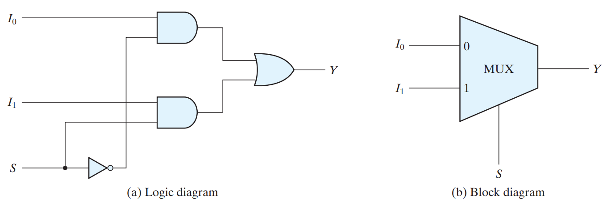

### 4-1 MUX

The function Y depends on four inputs I 0 , I 1 , I 2 , and I 3 and two select
inputs S1 and S0 . By placing the values of I 0
through I 3 in the Y column. Since there are six
variables, and only S1 and S0 are fixed, this single
row represents 16 rows of the corresponding full
truth table. From the table, we can write the
equation for Y as  
Y = S1’S0’ I0 + S1’S0 I1 + S1S0’I2 + S1S0 I3

|S1|S2|Y|
|---|---|---|
|0|0|I0|
|0|1|I1|
|1|0|I2|
|1|1|I3|  


## DEMULTIPLEXERS

### 1:2 DEMUX

A 1-to-2 demultiplexer consists of one input
line, two output lines and one select line.
The signal on the select line helps to switch
the input to one of the two outputs.
When the select input is LOW, then the
input will be passed to Y0 and if the select
input is HIGH, then the input will be passed
to Y1  
Y0 = S’ D  
Y1 = S D

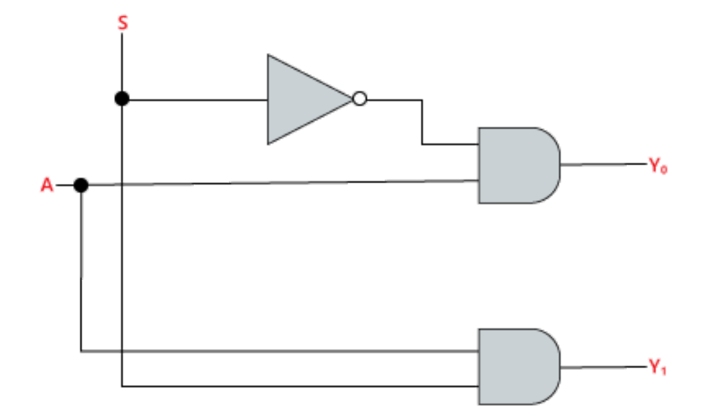


## PARITY GENERATOR

Many systems use a parity bit as a means for bit error detection. Any group
of bits contains either an even or an odd number of 1s. A parity bit is
attached to a group of bits to make the total number of 1s in a group always
even or always odd. An even parity bit makes the total number of 1s even,
and an odd parity bit makes the total odd.
A parity bit provides for the detection of a single bit error (or any odd
number of errors, which is very unlikely) but cannot check for two errors in
one group. For instance, let’s assume that we wish to transmit the BCD code
0101. (Parity can be used with any number of bits; we are using four for
illustration.) The total code transmitted, including the even parity bit, is


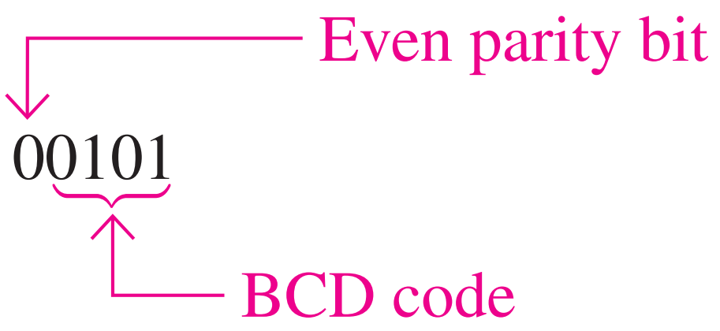

Now let’s assume that an error occurs in the third bit from the left (the 1
becomes a 0)


When this code is received, the parity check circuitry determines that there
is only a single 1 (odd number), when there should be an even number of 1s.
Because an even number of 1s does not appear in the code when it is
received, an error is indicated.

## CODE CONVERTER

### BCD to Binary Code converter

The binary numbers representing the weights of the BCD bits are summed
to produce the total binary number. The binary equivalent of each BCD bit is
a binary number representing the weight of that bit within the total BCD
number.

### Binary to Gray

Conversion between binary code and Gray code is
sometimes useful. The following rules explain how
to convert from a binary number to a Gray code
word:
1. The most significant bit (left-most) in the Gray
code is the same as the corresponding MSB in the
binary number.
2. Going from left to right, add each adjacent pair of
binary code bits to get the next Gray code bit.
Discard carries


### Gray to Binary
To convert from Gray code to binary, use a similar method;
however, there are some differences. The following rules apply:  

1. The most significant bit (left-most) in the binary code is the
same as the corresponding bit in the Gray code.
2. Add each binary code bit generated to the Gray code bit in the
next adjacent position. Discard carries.


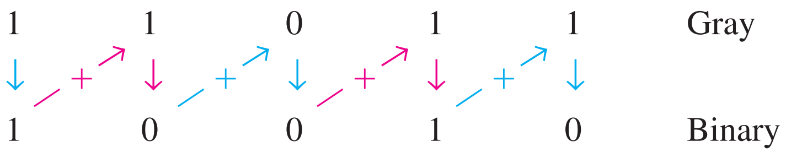

## COMPARATORS

The exclusive-NOR gate can be used as a basic comparator because its
output is a 0 if the two input bits are not equal and a 1 if the input bits are
equal.
The basic comparator can be expanded to any number of bits. The AND gate
sets the condition that all corresponding bits of the two numbers must be
equal if the two numbers themselves are equal.
To determine an inequality of binary numbers A and B, you first examine the
highest order bit in each number. The following conditions are possible: 1. If
A3 = 1 and B3 = 0, number A is greater than number B. 2. If A3 = 0 and B3 = 1,
number A is less than number B. 3. If A3 = B3, then you must examine the
next lower bit position for an inequality. These three operations are valid for
each bit position in the numbers. The general procedure used in a
comparator is to check for an inequality in a bit position, starting with the
highest-order bits (MSBs). When such an inequality is found, the relationship
of the two numbers is established, and any other inequalities in lower-order
bit positions must be ignored because it is possible for an opposite
indication to occur; the highest-order indication must take precedence.

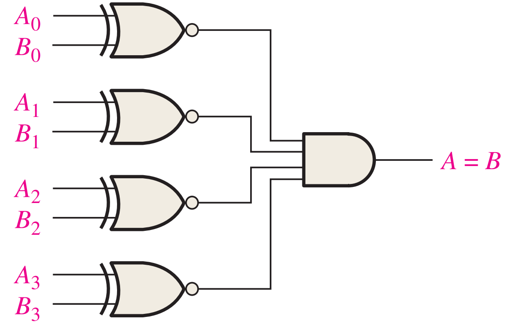


## Registers

A register is a group of flip‐flops, each one of which shares a common clock
and is capable of storing one bit of information. An n ‐bit register consists of
a group of n flip‐flops capable of storing n bits of binary information. In
addition to the flip‐flops, a register may have combinational gates that
perform certain data‐processing tasks.

### Four‐bit register

The common clock input triggers all flip‐flops on the
positive edge of each pulse, and the binary data
available at the four inputs are transferred into the
register. The value of (I3 , I2 , I1 , I0) immediately before
the clock edge determines the value of (A3 , A2 , A1 , A0)
after the clock edge. The four outputs can be sampled
at any time to obtain the binary information stored in
the register. The input Clear_b goes to the active‐low R
(reset) input of all four flip‐flops. When this input goes
to 0, all flip‐flops are reset asynchronously. The Clear_b
input is useful for clearing the register to all 0’s prior to
its clocked operation. The R inputs must be maintained
at logic 1 (i.e., de-asserted) during normal clocked
operation. Note that, depending on the flip‐flop, either
Clear, Clear_b, reset, or reset_b can be used to indicate
the transfer of the register to an all 0’s state.


### Four bit register with parallel load**Gi = Ai AND Bi  **

A four‐bit data‐storage register with a load
control input that is directed through gates
and into the D inputs of the flip‐flops. The
additional gates implement a two‐channel
mux whose output drives the input to the
register with either the data bus or the
output of the register. The load input to the
register determines the action to be taken
with each clock pulse.

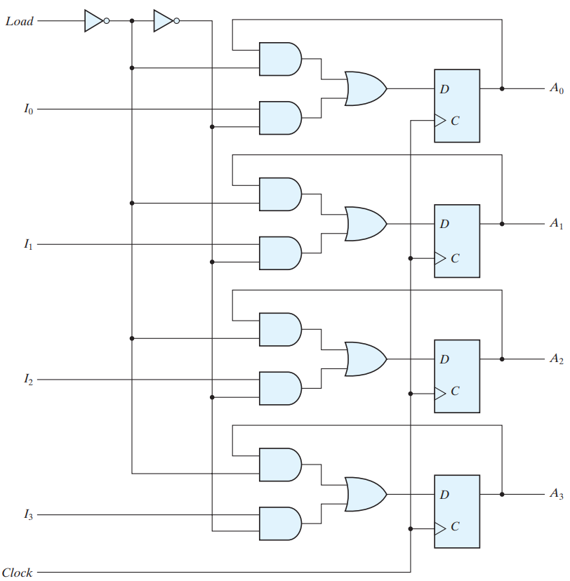

### SHIFT REGISTERS

#### SERIAL IN/SERIAL OUT REGISTERS

The serial in/serial out shift register accepts data serially—that is, one bit at a
time on a single line. It produces the stored information on its output also in serial form .


#### Serial In/Parallel Out Shift Registers

Data bits are entered serially (least-significant bit first) into a serial in/parallel
out shift register in the same manner as in serial in/serial out registers. The
difference is the way in which the data bits are taken out of the register; in
the parallel output register, the output of each stage is available. Once the
data is stored, each bit appears on its respective output line, and all bits are
available simultaneously, rather than on a bit-by-bit basis as with the serial
output.


#### Parallel In/Serial Out Shift Registers

For a register with parallel data inputs, the bits are entered simultaneously
into their respective stages on parallel lines rather than on a bit-by-bit basis
on one line as with serial data inputs.


#### Parallel In/Parallel Out Shift Registers

Parallel entry and parallel output of data have been discussed. The parallel
in/parallel out register employs both methods. Immediately following the
simultaneous entry of all data bits, the bits appear on the parallel outputs.

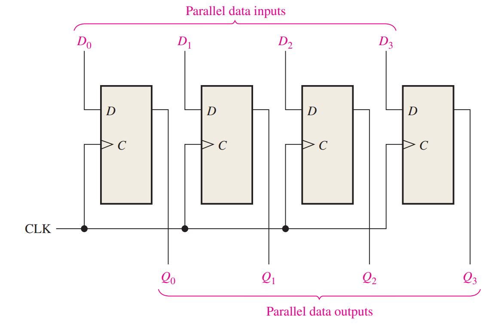

## COUNTERS

A register that goes through a prescribed sequence of states upon the
application of input pulses is called a counter. The input pulses may be clock
pulses, or they may originate from some external source and may occur at a
fixed interval of time or at random. The sequence of states may follow the
binary number sequence or any other sequence of states.

### BINARY RIPPLE COUNTER

A binary ripple counter
consists of a series
connection of
complementing flip‐flops,
with the output of each
flip‐flop connected to the
C input of the next higher
order flip‐flop. The
flip‐flop holding the least
significant bit receives
the incoming count
pulses. A complementing
flip‐flop can be obtained
from a JK flip‐flop with
the J and K inputs tied
together or from a T
flip‐flop. A third possibility
is to use a D flip‐flop with
the complement output
connected to the D
input.The output of each
flip‐flop is connected to
the C input of the next
flip‐flop in sequence. The
flip‐flop holding the least significant bit receives the incoming count pulses.
The bubble in front of the dynamic indicator symbol next to C indicates that
the flip‐flops respond to the negative‐edge transition of the input. The
negative transition occurs when the output of the previous flip‐flop to which
C is connected goes from 1 to 0.

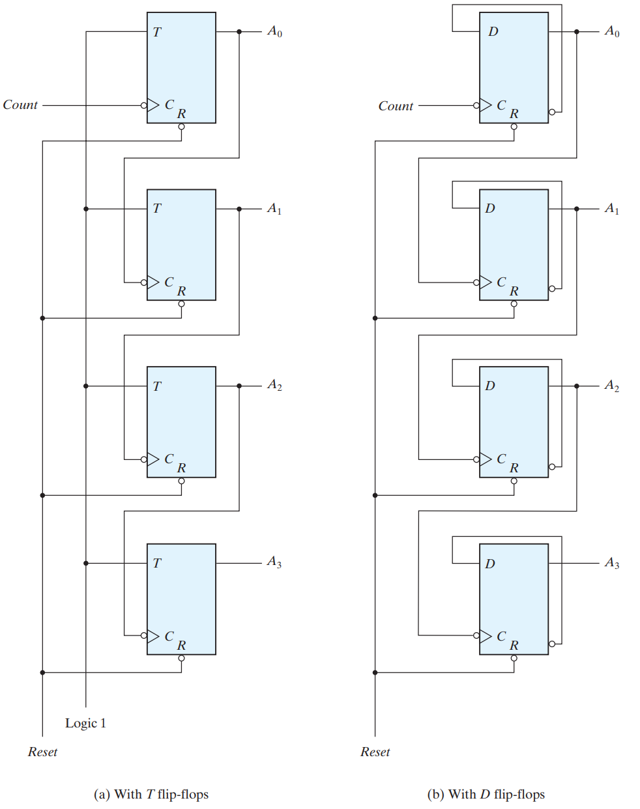

### BCD RIPPLE COUNTER

A decimal counter follows a sequence of 10 states and returns to 0 after the
count of 9. Such a counter must have at least four flip‐flops to represent
each decimal digit, since a decimal digit is represented by a binary code
with at least four bits. The sequence of states in a decimal counter is
dictated by the binary code used to represent a decimal digit.
The four outputs are designated by
the letter symbol Q, with a numeric
subscript equal to the binary
weight of the corresponding bit in
the BCD code. Note that the output
of Q1 is applied to the C inputs of
both Q2 and Q8 and the output of
Q2 is applied to the C input of Q4.
The J and K inputs are connected
either to a permanent 1 signal or to
outputs of other flip‐flops.


### 4 BIT SYNCHRONOUS BINARY COUNTER

The flip‐flop in the least significant position is complemented with every
pulse. A flip‐flop in any other position is complemented when all the bits in
the lower significant positions are
equal to 1 . Synchronous binary
counters have a regular pattern
and can be constructed with
complementing flip‐flops and
gates.
The C inputs of all flip‐flops are
connected to a common clock.
The counter is enabled by
Count_enable. If the enable input
is 0, all J and K inputs are equal to
0 and the clock does not change
the state of the counter. The first
stage, A0, has its J and K equal to
1 if the counter is enabled. The
other J and K inputs are equal to 1
if all previous least significant
stages are equal to 1 and the
count is enabled. The chain of
AND gates generates the required
logic for the J and K inputs in
each stage.
The counter can be extended to
any number of stages, with each
stage having an additional
flip‐flop and an AND gate that
gives an output of 1 if all previous
flip‐flop outputs are 1. Note that
the flip‐flops trigger on the
positive edge of the clock.

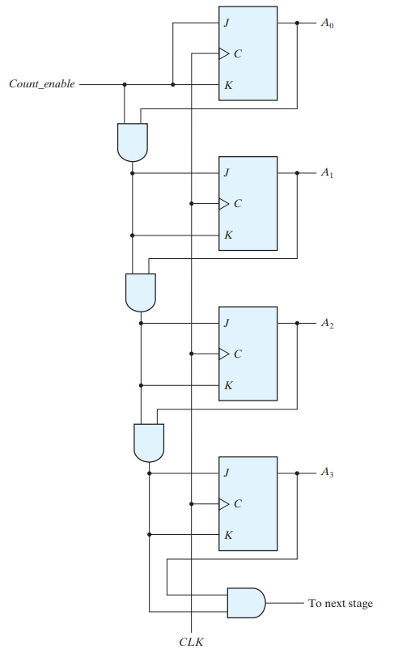

### FOUR BIT UP-DOWN BINARY COUNTER

The two operations can be combined in one circuit to form a counter
capable of counting either up or down. It has an up control input and a
down control input. When the up input is 1, the circuit counts up, since the T
inputs receive their signals from the values of the previous normal outputs
of the flip‐flops.

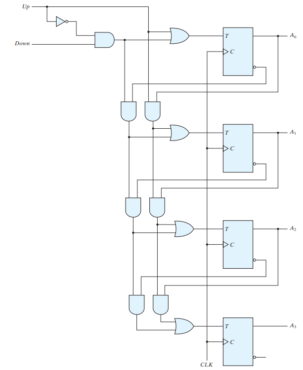

### BINARY COUNTER WITH PARALLEL LOAD

When equal to 1, the input load control disables the count operation and
causes a transfer of data from the four data inputs into the four flip‐flops. If
both control inputs are 0, clock pulses do not change the state of the
register. The carry output becomes a 1 if all the flip‐flops are equal to 1 while
the count input is enabled. This is the condition for complementing the
flip‐flop that holds the next significant bit. The carry output is useful for
expanding the counter to more than four bits. The speed of the counter is
increased when the carry is generated directly from the outputs of all four
flip‐flops, because the delay to generate the carry bit is reduced.
A counter with a parallel load can be used to generate any desired count
sequence.the Count control is set to 1 to enable the count through the CLK
input. Also, recall that the Load control inhibits the count and that the clear
operation is independent of other control inputs.

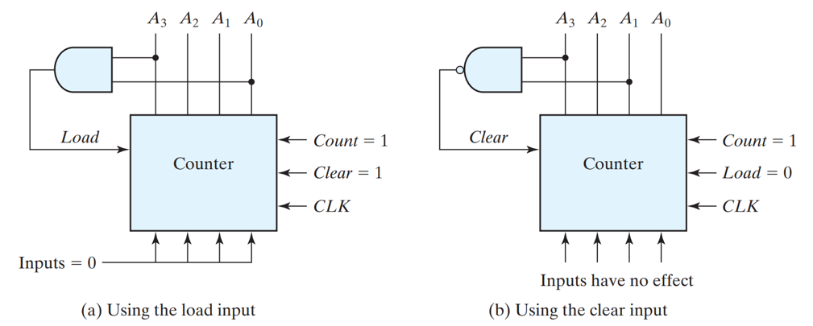
[]"(Intro/image-0120.png)

## ARITHMETIC LOGIC UNIT (ALU)

The ALU, or arithmetic logic unit, is a crucial component of the CPU (central
processing unit) in a computer system. It is responsible for carrying out
arithmetic and logic operations. Also referred to as the integer unit (IU), it is
an integrated circuit found in both CPUs and GPUs. The ALU is the final
stage in the processor where calculations are performed. It possesses the
capability to handle various tasks related to arithmetic and logic operations,
including addition, subtraction, shifting operations, as well as Boolean
comparisons such as XOR, OR, AND, and NOT operations. It operates on
binary numbers and can execute mathematical and bitwise operations. The
ALU consists of two units: the arithmetic unit (AU) and the logic unit (LU). By
utilizing operands and codes, the ALU determines which operations to
perform based on the input data provided. Once the ALU completes
processing the input, the resulting information is sent to the computer's
memory.  

Here are the main functions of an ALU:  
 
**Arithmetic Operations**: The ALU performs various arithmetic operations on
binary numbers, such as addition, subtraction, multiplication, and division. It
uses binary addition and subtraction circuits to handle these operations
efficiently.  

**Logical Operations**: The ALU executes logical operations on binary data,
including AND, OR, XOR (exclusive OR), and NOT. These operations
manipulate individual bits or binary values to determine logical relationships
and produce logical results.  

**Comparison Operations**: The ALU performs comparison operations to
determine the relationship between two binary values. It can compare if two
values are equal, not equal, greater than, less than, greater than or equal to,
or less than or equal to each other. The result of these comparisons is
typically represented by setting specific flags or registers in the CPU.

**Bitwise Operations**: The ALU carries out bitwise operations, which
manipulate individual bits in binary numbers. These operations include
shifting the bits left or right, rotating bits, and masking operations. Bitwise
operations are commonly used in tasks such as data manipulation,
encryption, and signal processing.  

**Conditional Operations**: The ALU supports conditional operations, enabling
the CPU to execute different instructions based on certain conditions. For
example, it can perform conditional branching, where the CPU jumps to a
specific instruction address based on the result of a comparison operation.

**Data Movement**: The ALU may also handle data movement operations
within the CPU. This involves transferring data between registers, memory,
and other CPU components.

## ENCODER

An encoder is a digital circuit that performs the inverse operation of a
decoder. An encoder has 2n (or fewer) input lines and n output lines.

### PRIORITY ENCODER

A priority encoder is an encoder circuit that includes the priority function.
The operation of the
priority encoder is such
that if two or more inputs
are equal to 1 at the same
time, the input having the
highest priority will take
precedence.
In addition to the two
outputs x and y , the
circuit has a third output
designated by V ; this is a
valid bit indicator that is set to 1 when one or more inputs are equal to 1. If all
inputs are 0, there is no valid input and V is equal to 0. The other two outputs
are not inspected when V equals 0 and are specified as don’t-care
conditions.  

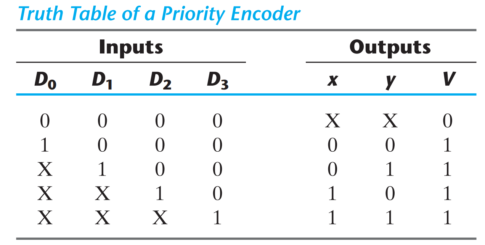
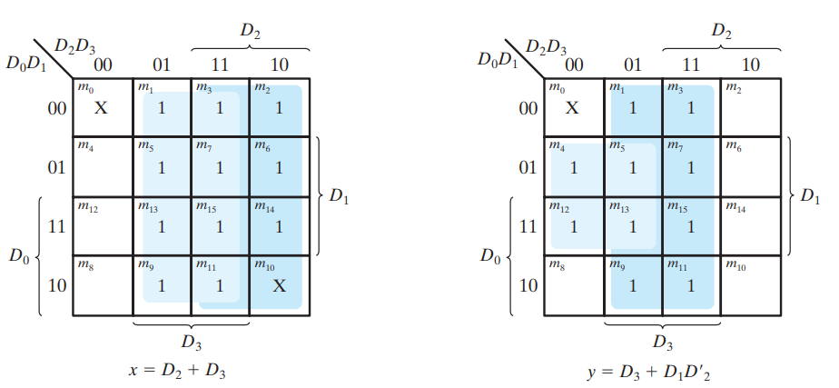

x = D2+ D3   
y = D3 + D1 D 2  
V = D0 + D1 + D2 + D3

[]"(Intro/image-0132.png)

## DECODER  

A decoder is a combinational circuit that converts binary information from n
input lines to a maximum of 2n unique output lines.The decoders presented
here are called n -to- m -line decoders, where m … 2^n.

### 3-8 LINE DECODER

The three inputs are decoded into
eight outputs, each representing one
of the minterms of the three input
variables. The three inverters provide
the complement of the inputs, and
each one of the eight AND gates
generates one of the minterms.

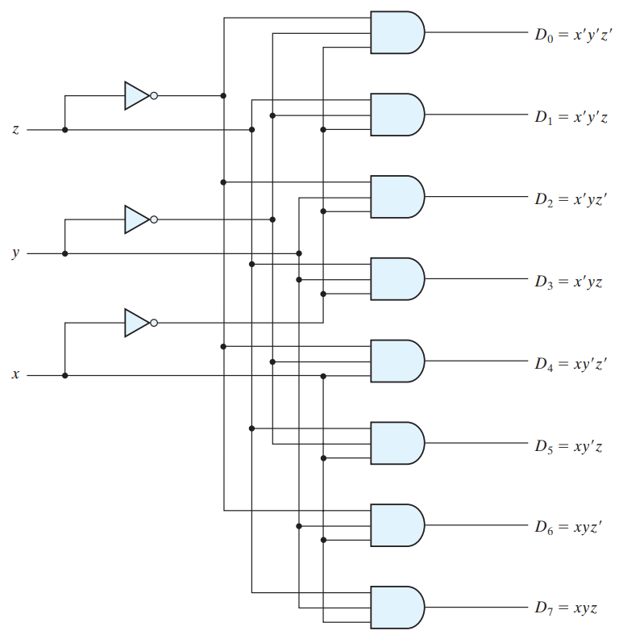
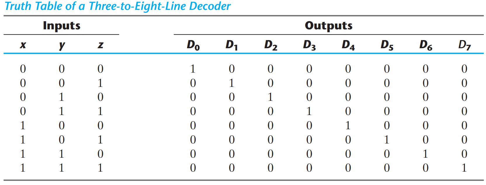

### 2-4 LINE DECODER WITH ENABLE INPUT

The circuit operates with complemented outputs and a complement enable
input. The decoder is enabled when E is equal to 0 (i.e., active-low enable). As
indicated by the truth table, only one output can be equal to 0 at any given
time; all other outputs are equal to 1. The output whose value is equal to 0
represents the minterm selected by inputs A and B . The circuit is disabled
when E is equal to 1, regardless of the values of the other two inputs. When
the circuit is disabled, none of the outputs are equal to 0 and none of the
minterms are selected.


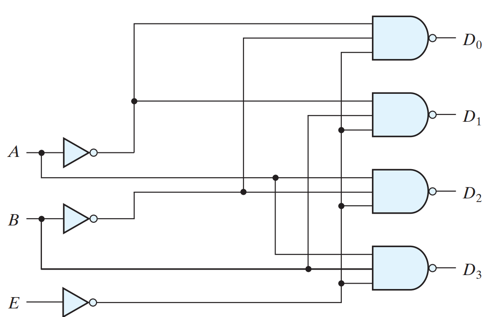

# HOW TO MAKE A VERILOG PROGRAM


### Create a New Project in your own version of Quartus Prime.


### Select an appropriate directory for your Verilog project files and create an empty project file template.

![[]" src=](Intro/image-0147.png)

### Use the 10M50DAF484C7G Board from the MAX 10 Family.

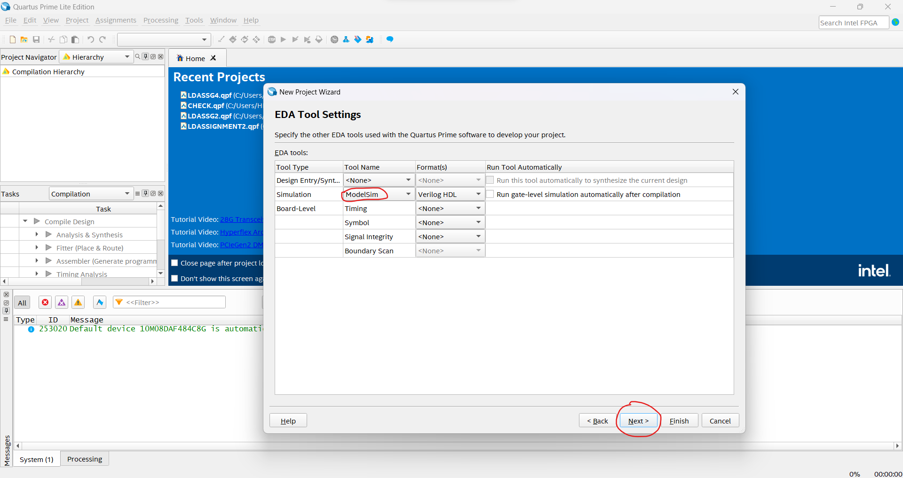


### Set ModelSim as your Simulation Tool (ModelSim must be installed prior) and finish the initialization of the project.

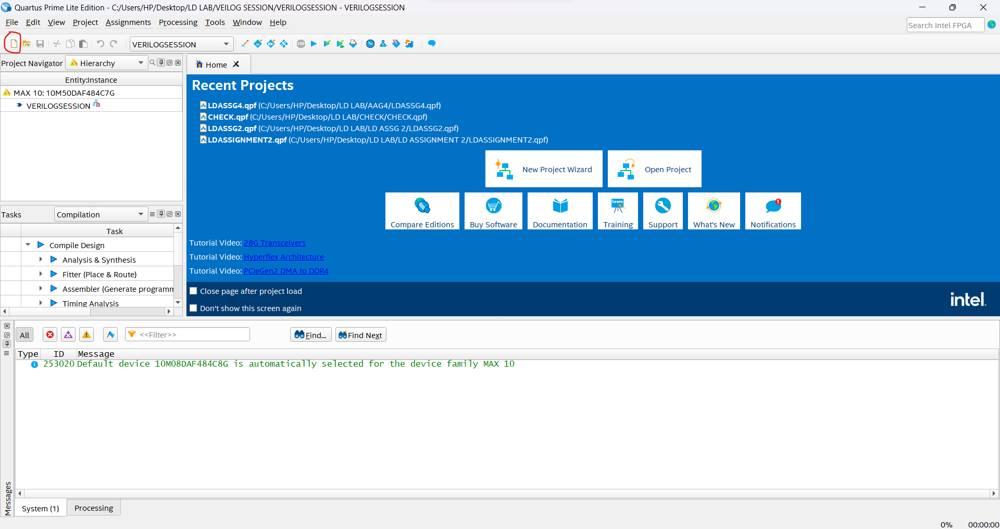

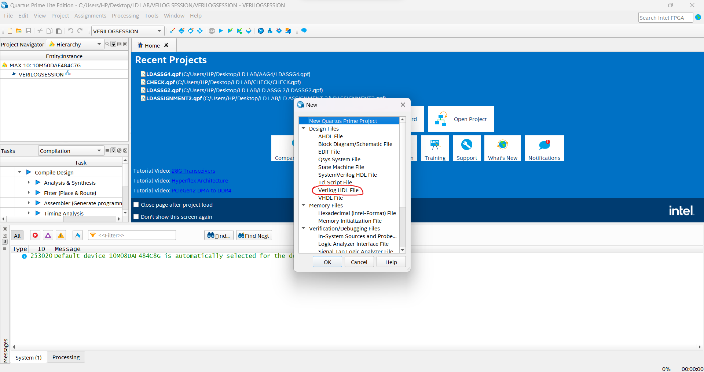

### Click on the file icon in the top left corner and create a new Verilog HDL file.


### When you wish to save your program, simply use Ctrl+S or click the Save icon in the top left corner.

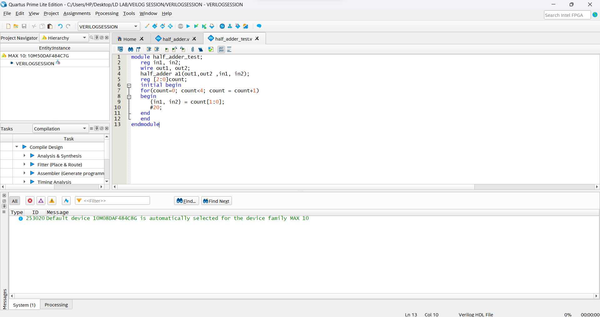


### Before running your program, you must first set a testbench for it. Do this by going into the Assignments menu and clicking Settings.

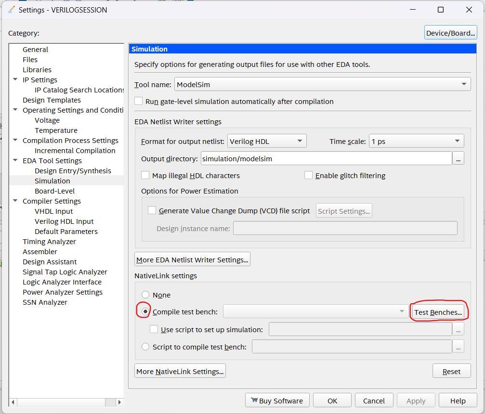


### Change the NativeLink Setting to Compile Test Bench and select the Test Bench file for your program.

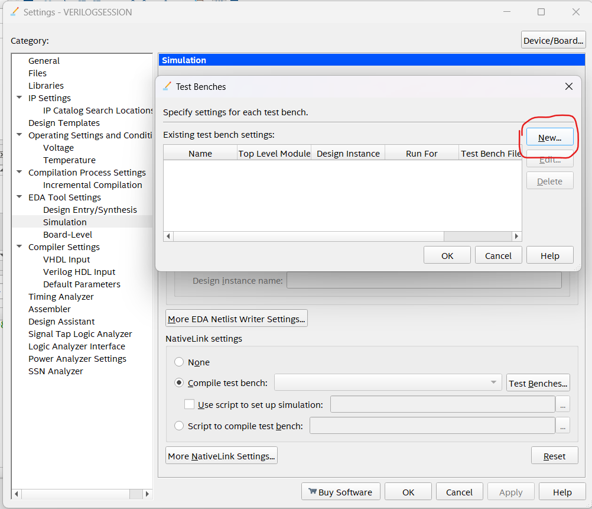


### Create a new Test Bench if you are creating one for a new program that has not been made before.

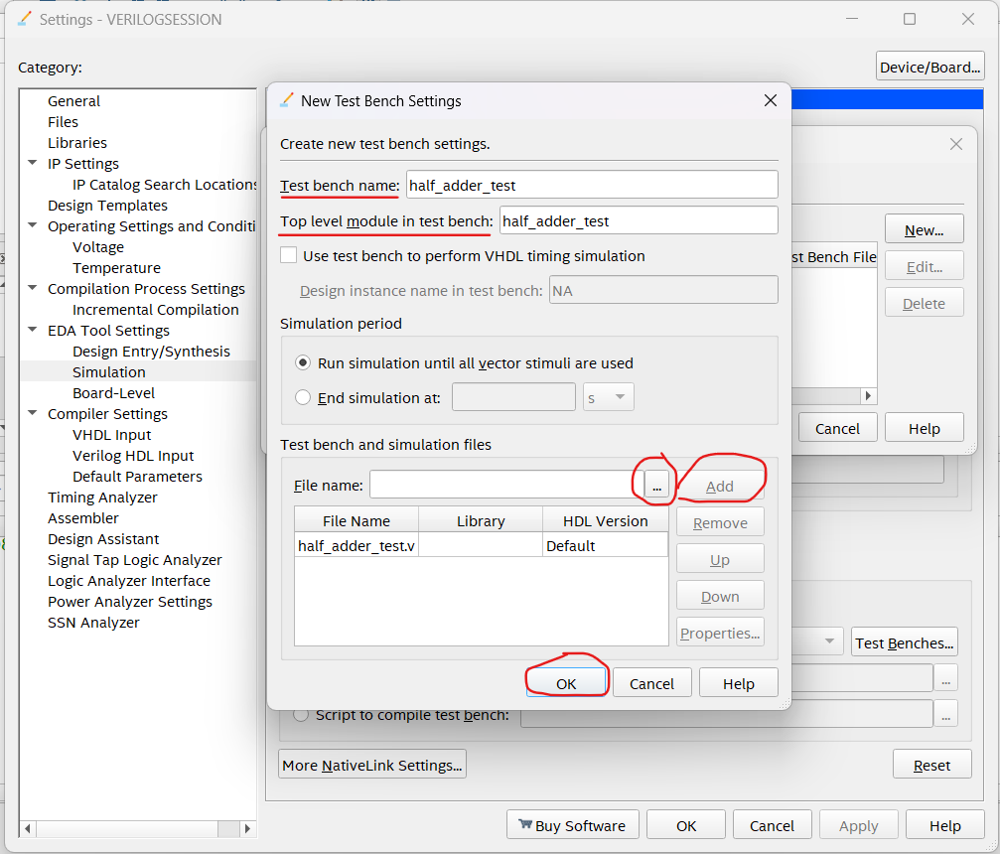


### Name your Test Bench appropriately (usually just the name of the test bench file) and add it to the list of Test Benches.


### After setting your testbench, you can now run and compile your program by clicking on the third play button.  

### You will be able to view your circuit design and how it is structured, and simulate results using the test bench by going to the Tools menu.

## BIBLIOGRAPHY

1. Digital Design, 5th Edition by M Morris Mano and Michael Ciletti  
2. Digital Fundamentals by Floyd and Jain  
3. [electronicshub.org/demultiplexerdemux](https://www.electronicshub.org/demultiplexerdemux/)  
4. [tutorialspoint.com/digital_circuits/digital_circuits_flip_flops](https://www.tutorialspoint.com/digital_circuits/digital_circuits_flip_flops.htm)  
5. [tutorialspoint.com/digital_circuits/digital_circuits_demultiplexers](https://www.tutorialspoint.com/digital_circuits/digital_circuits_demultiplexers.htm)  

